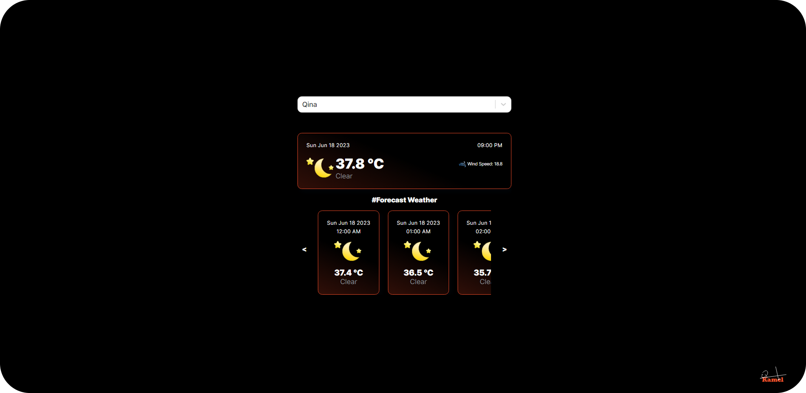

# React Weather App ⛅

This is a weather app built with React.js and Open-Meteo API. It allows users to search for any city in the world and see the current weather conditions such as temperature, weather description, and wind speed. It also displays the date and time of the location. The app also shows the forecast weather for the next day. The app uses Axios to fetch data from the Open-Meteo API and React Hooks to manage the state and effects. The app is responsive and has a simple and elegant design.

---

